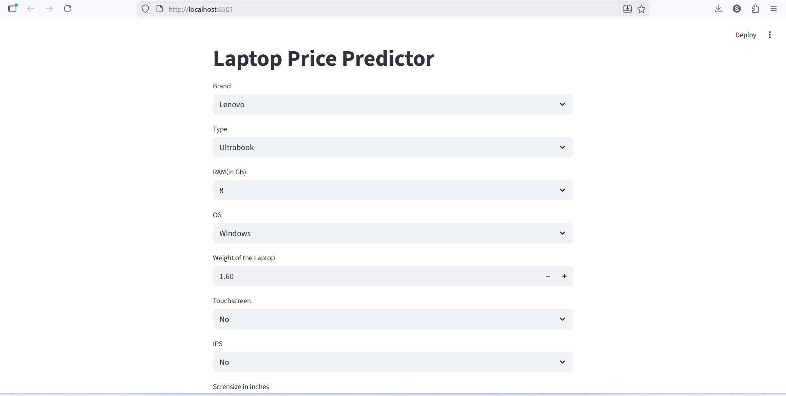
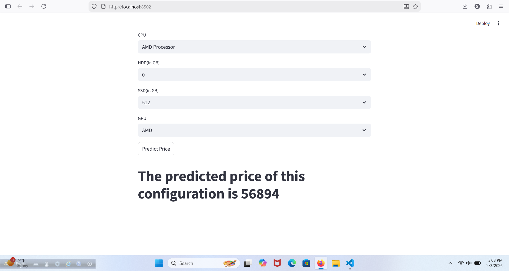
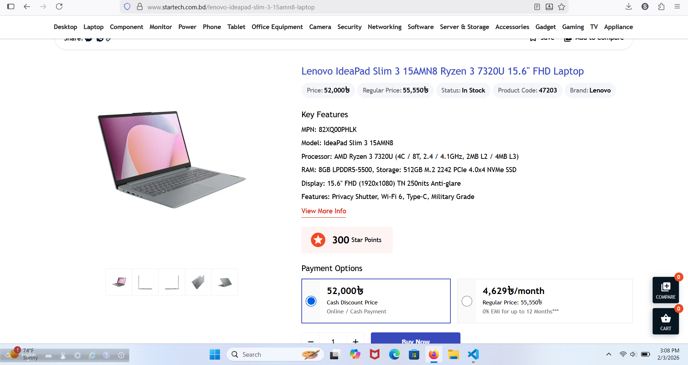

# 💻 Laptop Price Predictor (Streamlit ML Web App)

This project is an end-to-end Machine Learning web application that
predicts the **price of a laptop** based on its specifications. The
system is built using **Python, Pandas, Scikit-learn, and Streamlit**,
and demonstrates how a trained ML model can be deployed as an
interactive web app.

The application takes real-world laptop configuration inputs and
predicts the expected market price using a pre-trained regression
pipeline.

------------------------------------------------------------------------

## 🚀 Project Highlights

-   End-to-end ML workflow (data → model → deployment)
-   Feature engineering including **PPI (Pixels Per Inch)** calculation
-   Trained ML pipeline saved using `pickle`
-   Interactive **Streamlit** web interface
-   Real dataset of laptop configurations
-   Clean and user-friendly prediction system

------------------------------------------------------------------------

## 📌 Features Used for Prediction

The model predicts laptop price using:

-   Brand (Company)
-   Laptop Type
-   RAM
-   Operating System
-   Weight
-   Touchscreen Support
-   IPS Display
-   Screen Size
-   Screen Resolution (converted to PPI)
-   CPU Brand
-   HDD Capacity
-   SSD Capacity
-   GPU Brand

------------------------------------------------------------------------

## 🧠 Special Feature Engineering

The app automatically calculates **PPI (Pixels Per Inch)** from screen
resolution and screen size:

PPI = sqrt(X² + Y²) / ScreenSize

This improves the model's understanding of display quality.

------------------------------------------------------------------------

## 🗂️ Project Structure

    Laptop-Price-Predictor/
    │
    ├── app.py
    ├── pipe.pkl
    ├── df.pkl
    ├── laptop_data.csv
    ├── requirements.txt
    └── assets/

------------------------------------------------------------------------

## ▶️ How to Run the Project

### 1️⃣ Clone the Repository

``` bash
git clone https://github.com/shubro-das/Laptop-Price-Predictor-.git
cd Laptop-Price-Predictor-
```

### 2️⃣ Install Dependencies

``` bash
pip install -r requirements.txt
```

### 3️⃣ Run the Streamlit App

``` bash
streamlit run app.py
```

------------------------------------------------------------------------

## 🖥️ Application Preview

Screenshots of the prediction interface and outputs:
### 🔹 Web Interface


### 🔹 Predicted Price Output


### 🔹 Real Price from Dataset


------------------------------------------------------------------------

## 📊 Dataset

The project uses a real-world laptop dataset containing various hardware
and software specifications along with prices.

------------------------------------------------------------------------

## 🛠️ Tech Stack

-   Python
-   Pandas, NumPy
-   Scikit-learn
-   Streamlit
-   Pickle

------------------------------------------------------------------------

## 🎯 Purpose of the Project

This project demonstrates:

-   Practical ML model deployment
-   Feature engineering for better predictions
-   Building real ML web applications
-   Portfolio-level data science project for real-world scenarios

------------------------------------------------------------------------

## 👨🏻‍💻 Author

**Shubro Das**\
GitHub: https://github.com/shubro-das


